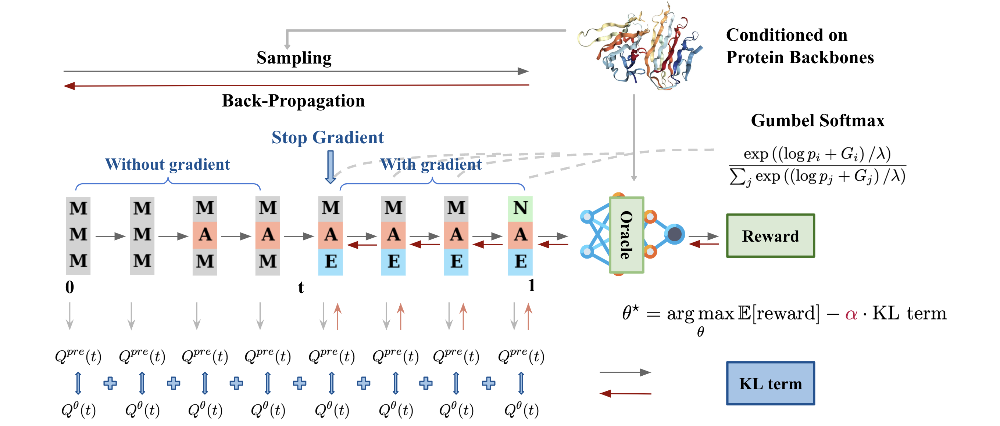

# Fine-Tuning Discrete Diffusion Models via Reward Optimization with Applications to DNA and Protein Design

The repository contains the code for the `DRAKES` method presented in the paper: *Fine-Tuning Discrete Diffusion Models via Reward Optimization with Applications to DNA and Protein design (2024)*.

## Data and Model Weights
All data and model weights can be downloaded from this link:

https://www.dropbox.com/scl/fi/zi6egfppp0o78gr0tmbb1/DRAKES_data.zip?rlkey=yf7w0pm64tlypwsewqc01wmfq&st=xe8dzn8k&dl=0

Save the downloaded file in `BASE_PATH`.

## Regulatory DNA Sequence Design
The code and instructions are in `drakes_dna/`.

## Protein Sequence Design: Optimizing Stability in Inverse Folding Model
The code and instructions are in `drakes_protein/`.
