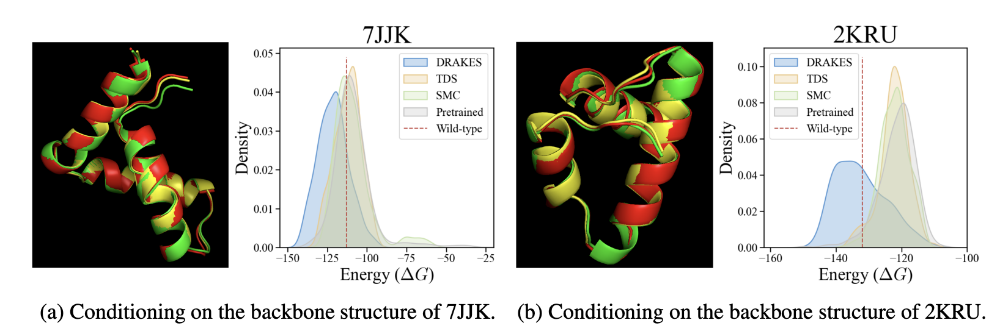

# Fine-Tuning Discrete Diffusion Models via Reward Optimization with Applications to DNA and Protein Design

The repository contains the code for the `DRAKES` method presented in the paper: *[Fine-Tuning Discrete Diffusion Models via Reward Optimization with Applications to DNA and Protein design](https://arxiv.org/abs/2410.13643)(2024)*.
`DRAKES` is a fine-tuning method for reward optimization or alignment in discrete diffusion models, utilizing direct backpropagation with the softmax-gumbel trick.


## Data and Model Weights
All data and model weights can be downloaded from this link:

https://www.dropbox.com/scl/fi/zi6egfppp0o78gr0tmbb1/DRAKES_data.zip?rlkey=yf7w0pm64tlypwsewqc01wmfq&st=xe8dzn8k&dl=0

Save the downloaded file in `BASE_PATH`.


## Regulatory DNA Sequence Design

Our goal here is to optimize the activity of regulatory DNA sequences such that they drive gene expression in specific cell types, a critical task for cell and gene therapy. The detailed code and instructions are in `drakes_dna/`. 

## Protein Sequence Design: Optimizing Stability in Inverse Folding Model

Given a pretrained inverse folding model that generates sequences conditioned on the
backbone’s conformation (3D structure), our goal is to optimize the stability of these generated sequences.  The illustrative figure is as follows. The code and instructions are in `drakes_protein/`.




## Citation 

If you find this work useful in your research, please cite:

```
@article{wang2024finetuning,
  title={Fine-Tuning Discrete Diffusion Models via Reward Optimization with Applications to DNA and Protein Design},
  author={Chenyu Wang and Masatoshi Uehara and Yichun He and Amy Wang and Tommaso Biancalani and Avantika Lal and Tommi Jaakkola and Sergey Levine and Hanchen Wang and Aviv Regev},
  journal={arXiv preprint arXiv:2410.13643},
  year={2024}
}
```